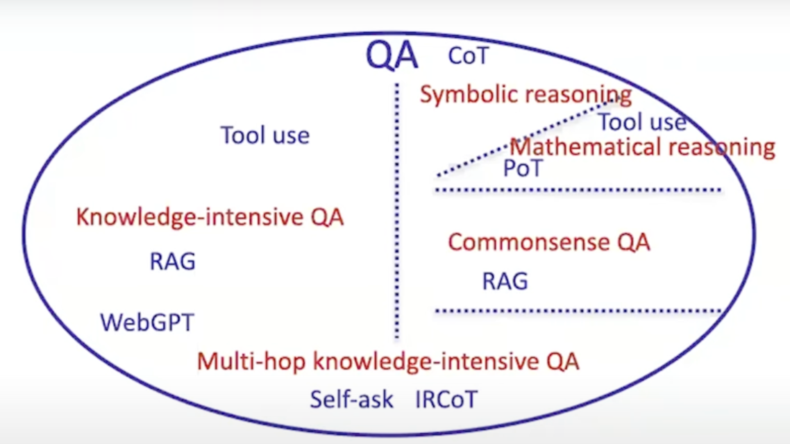

# llm—agent 导论
## 大语言收到的挑战和解决方案

| 挑战                          | 解决方案         | 解释                                                                 |
|------------------------------|------------------|---------------------------------------------------------------------------|
| 知识密集型问答                | RAG              | RAG（检索增强生成）通过检索外部知识库来增强模型的回答能力。例如：用户问“2023年诺贝尔物理学奖得主是谁？”，模型通过RAG检索最新信息后回答“皮埃尔·阿戈斯蒂尼等人”，而不是依赖过时的训练数据。 |
| 知识密集型问答            | WebGPT           | WebGPT通过网络搜索和多步推理回答复杂问题。例如：用户问“哪位科学家的理论启发了爱因斯坦的相对论？”，WebGPT会先搜索“爱因斯坦的相对论受到谁的影响”，找到“洛伦兹变换”，再进一步搜索“洛伦兹是谁”，最终回答“亨德里克·洛伦兹”。 |
| 多跳知识密集型问答            | Self-ask         | Self-ask通过自我提问分解问题。例如：用户问“谁发明了电话并且他的出生地在哪里？”，模型会分解为“谁发明了电话？”（回答：亚历山大·贝尔）和“亚历山大·贝尔的出生地是哪里？”（回答：苏格兰爱丁堡），最后整合回答。 |
| 多跳知识密集型问答                      | IRCOT            | IRCOT（交互式思维链）通过逐步推理解决常识问题。例如：用户问“为什么下雨天不能用金属伞？”，模型会推理：1）金属导电，2）下雨天可能有雷电，3）雷电可能击中金属伞导致危险，最终回答“因为金属伞可能导电，增加被雷击的风险”。 |
| 常识问答                      | RAG              | RAG同样适用于常识问答，增强模型的常识推理能力。例如：用户问“为什么天是蓝色的？”，模型通过RAG检索科学知识，回答“因为大气散射了短波长的蓝光”，而不是给出模糊或错误的回答。 |
| 符号推理                      | CoT              | CoT（思维链）通过逐步推理解决符号推理问题。例如：用户问“如果A>B，B>C，那么A和C的关系是什么？”，模型会逐步推理：1）A>B，2）B>C，3）所以A>C，最终回答“A大于C”。 |
| 数学推理                      | PoT              | PoT（程序化思维）通过程序化步骤解决数学问题。例如：用户问“计算1+2+3+…+10的和”，模型会列出步骤：1）识别为等差数列求和，2）使用公式n(n+1)/2，3）代入n=10，计算10*11/2=55，最终回答“55”。 |
| 数学推理                      | Tool use         | Tool use表示模型调用外部工具解决问题。例如：用户问“今天的天气如何？”，模型通过调用天气API获取最新数据，回答“今天是晴天，温度25°C”，而不是依赖训练数据中的过时信息。 |

---
## 关于记忆
*   **语言模型的短期记忆 (Short-term memory)**:
    *   语言模型的上下文窗口可以被视为其短期记忆。
    *   这个记忆是**只可追加的 (append-only)**，只能向其中添加新的 token。
    *   **容量有限 (limited context)**，尽管 token 数量在不断增加，但仍然存在上限。
    *   可能存在**注意力限制 (limited attention)**，在处理过长的序列时，模型可能难以关注所有相关信息。
    *   **不持久化 (does not persist)**，这种记忆不会在不同的任务或时间段之间保留。例如，即使模型今天解决了黎曼猜想，如果没有经过微调，下次仍然需要从头开始。

*   **长期记忆 (Long-term memory) 的概念和动机**:
    *   为了克服短期记忆的局限性，引入了长期记忆的概念。
    *   类比于人类的日记或数学家的论文，长期记忆旨在**记录和存储重要的经验、知识和技能，使其能够在未来的新经验中被利用**。
    *   希望长期记忆能够**跨越不同的任务和时间**，使得智能体不必每次都从零开始学习。
    *   将无法记住过去经验的智能体比作只有三秒记忆的金鱼。

*   **长期记忆的简单形式：反思 (Reflection)**:
    *   反思是一种简单的长期记忆形式，智能体在完成任务后（例如编程）可以**回顾自己的经验**。
    *   如果任务失败（例如测试未通过），智能体可以**思考失败的原因**，并将这些反思到的信息**持久化到长期记忆中**。
    *   在下次尝试类似任务时，智能体可以**读取这些长期记忆**，从而避免重复犯相同的错误，提高性能。
    *   这种机制可以被视为一种**新的学习方式**，与传统的强化学习通过奖励信号反向传播更新权重不同，反思是通过更新语言形式的记忆（任务知识）来影响未来的行为。

*   **更复杂的长期记忆形式**:
    *   **基于代码技能的记忆 (Voyager)**：智能体可以学习和存储特定领域（例如 Minecraft）的代码技能，并在需要时检索和使用，而不是每次都从头开始。
    *   **情景记忆 (Episodic memory) (Generative Agents)**：智能体详细记录所有发生的事件（例如每小时的日志），以便在需要时查找和回忆相关信息。
    *   **语义记忆 (Semantic memory) (Generative Agents)**：智能体可以分析和总结其情景记忆中的信息，从而**推断出关于自己或他人的知识**，并利用这些知识影响未来的行为。

*   **语言模型本身作为一种长期记忆**:
    *   语言模型的**神经网络参数本身可以被视为一种长期记忆**，存储了训练数据中学到的知识。
    *   学习可以通过**改变神经网络的参数（微调）**或**在外部长期记忆中存储和检索信息**来实现。
    *   将神经网络和外部文本语料库都视为长期记忆的形式，可以得到**统一的学习抽象**。

*   **记忆作为智能体的组成部分**:
    *   一个智能体可以通过三个关键部分来定义：**记忆 (memory)**（信息存储的地方）、**行动空间 (action space)**（智能体可以采取的行动）和**决策过程 (decision-making procedure)**（基于当前信息选择哪个行动）。

*   **内部记忆与外部环境的界限**:
    *   对于数字智能体来说，**区分内部记忆和外部环境可能比物理智能体更模糊**。例如，智能体在 Google Docs 中写入信息是长期记忆还是改变外部环境的行动？从互联网档案中检索知识是行动还是从长期记忆中检索？

*   **长期记忆与短期记忆的界限**:
    *   **定义长期记忆与短期记忆的界限是困难的**，特别是当语言模型的上下文窗口变得非常大时（例如 1000 万 token），很难判断它仍然是短期记忆还是已经可以被视为长期记忆。这些术语最初来源于人类心理学和神经科学。

### 智能体在 Google Docs 中写入信息：长期记忆还是改变外部环境的行动？
> 从 CoALA 的角度来看，这可以被理解为同时涉及内部状态的更新（如果将写入的内容视为未来决策的依据）以及与外部数字环境的交互。
•
视为改变外部环境的行动 (Grounding Action)：Google Docs 是一个外部的数字环境。智能体通过执行“写入”这个动作，与这个环境进行交互，改变了其状态。这类似于智能体控制一个机器人手臂（物理环境）或调用一个 API（数字环境）来产生外部效应。论文将与外部环境的交互定义为“接地 (grounding)”行动。
•
与长期记忆相关联 (Long-Term Memory)：如果智能体的设计是将 Google Docs 作为其长期记忆的一种形式，那么写入操作也可以被视为更新其长期记忆的过程。CoALA 讨论了多种长期记忆的形式，虽然没有明确提到 Google Docs，但原则上，一个可以持久存储和检索信息的外部资源可以被智能体架构设计为长期记忆的一部分。例如，智能体可能会将重要的经验、知识或计划写入 Google Docs 以供未来参考。在这种情况下，“写入”这个行动的目的是为了持久化信息，使其在未来的决策周期中可以被“检索”到。

### 从互联网档案中检索知识：行动还是从长期记忆中检索？
> 类似地，从 CoALA 的视角来看，这取决于智能体的架构如何处理互联网档案。
•
视为行动 (Retrieval Action)：CoALA 将“检索 (retrieval)”定义为智能体行动空间的一部分，用于访问内部记忆模块。然而，如果互联网档案被视为智能体外部的知识源（类似于一个外部数据库或搜索引擎），那么检索操作可以被看作是智能体与外部环境交互的一种形式，更接近于 CoALA 中描述的**接地 (grounding)**行动，特别是与数字环境的交互。论文中提到，使用外部资源（如互联网）来增强 LLM 的能力是语言智能体的一个关键特征。
•
与长期记忆相关联 (Long-Term Memory)：如果智能体拥有一个内部的长期记忆模块，该模块存储了从互联网档案中预先处理或缓存的信息，那么从这个内部模块中获取信息才会被视为从长期记忆中检索。然而，直接访问外部的互联网档案并从中获取信息，更像是执行一个“搜索”或“查询”的外部行动，其结果会被带回智能体的上下文（工作记忆）中使用。论文中讨论了检索增强的语言模型，它们通常是从人类编写的语料库中读取信息，但记忆增强的智能体可以读写自己生成的内容。

## 展望未来

*   **训练 (Training)**:
    *   **视频**: 强调了当前语言模型和 Agent 的训练是分离的，模型通常在与 Agent 任务无关的文本数据上训练。这导致了数据分布的差异，影响了 Agent 的性能。
    *   **视频**: 提出了**针对 Agent 任务训练模型**的思路，例如使用 Prompted Agents 生成大量Agent行为数据，然后用这些数据来微调模型，使其更擅长执行Agent任务。
    *   **视频**: 类比了 GPU 和深度学习的协同发展，认为模型和 Agent 之间也应该建立协同关系，即不仅使用现有模型构建 Agent，也应该训练更适合 Agent 的模型。
    *   **论文**: CoALA 框架强调学习 (Learning) 是 Agent 行动空间中的一个重要组成部分，包括存储新的经验或知识，或者编写新的 Agent 代码。论文还提出了**新的学习（和非学习）形式**，例如为特定的推理子任务微调较小的模型。

*   **界面 (Interface)**:
    *   **视频**: 指出人机界面是一个重要的研究领域，即使 Agent 本身的能力没有提升，**优化 Agent 所处的环境（界面）也能提高其性能**。
    *   **视频**: 以文件搜索为例，说明传统的终端命令可能不适合 Agent，而设计新的命令（例如 `search` 并返回多个结果）更有效。
    *   **视频**: 提出模型和人类的能力不同，因此需要探索**不同于人类使用的社会界面**。
    *   **论文**: CoALA 讨论了**接地 (Grounding)** 行动，即 Agent 如何与外部环境（包括数字环境）交互，通过将感知输入转化为文本，并将语言指令转化为环境可执行的动作。论文强调，为 Agent 定义清晰且适合任务的行动空间（包括内部和外部行动）有助于系统化 Agent 设计。

*   **鲁棒性 (Robustness)**:
    *   **视频**: 指出了现有评测基准与真实世界需求的差距。真实世界中，对于一些任务（例如简单的调试、客服），**可靠性比偶尔成功一次更重要**。
    *   **视频**: 通过实验展示，随着采样次数的增加，当前语言模型在同一任务上的鲁棒性会下降，理想情况应该是更平稳的表现。
    *   **视频**: 认为需要**将更多真实世界的因素纳入评测基准**，并开发新的评测设置和指标。
    *   **论文**: CoALA 讨论了决策制定过程，强调了提议、评估和选择行动的重要性。虽然没有直接提到“鲁棒性”这个词，但更复杂的决策过程，例如迭代地提议和评估多个行动，可以被认为是提高 Agent 鲁棒性的一种尝试。论文还提到了校准和对齐是更复杂决策制定的瓶颈问题。

*   **人机协作 (Human)**:
    *   **视频**: 在讨论鲁棒性时，提到了**与人类真实用户的交互**。例如，在“更改航班”这样的任务中，Agent可能需要与用户进行多轮对话以明确需求。
    *   **视频**: 强调了真实世界中，Agent 需要在不确定的情况下与人类进行交互。
    *   **论文**: CoALA 将与人类的通信视为 Agent 与**外部环境（数字或物理）交互的一种形式 (Grounding Actions)**。论文还提到了人机回路机制在面对不确定性时的重要性，这与视频中强调的人机交互相关联。

*   **评测 (Benchmark)**:
    *   **视频**: 强调了**构建好的评测基准**的重要性。
    *   **视频**: 指出现有评测基准与真实世界需求的差距，需要新的评测设置和指标来衡量 Agent 在真实场景下的表现。
    *   **论文**: CoALA 提到了当前不同的 Agent 使用自定义术语描述其过程，使得比较和理解 Agent 的演变变得困难。论文建议**为语言 Agent 实现有用的抽象（例如 Memory、Action、Agent 类）**，并构建一个实证的 CoALA 框架，将简单的 Agent 纳入其中，作为构建更复杂 Agent 的示例。这可以看作是为 Agent 的评测和比较奠定基础。

